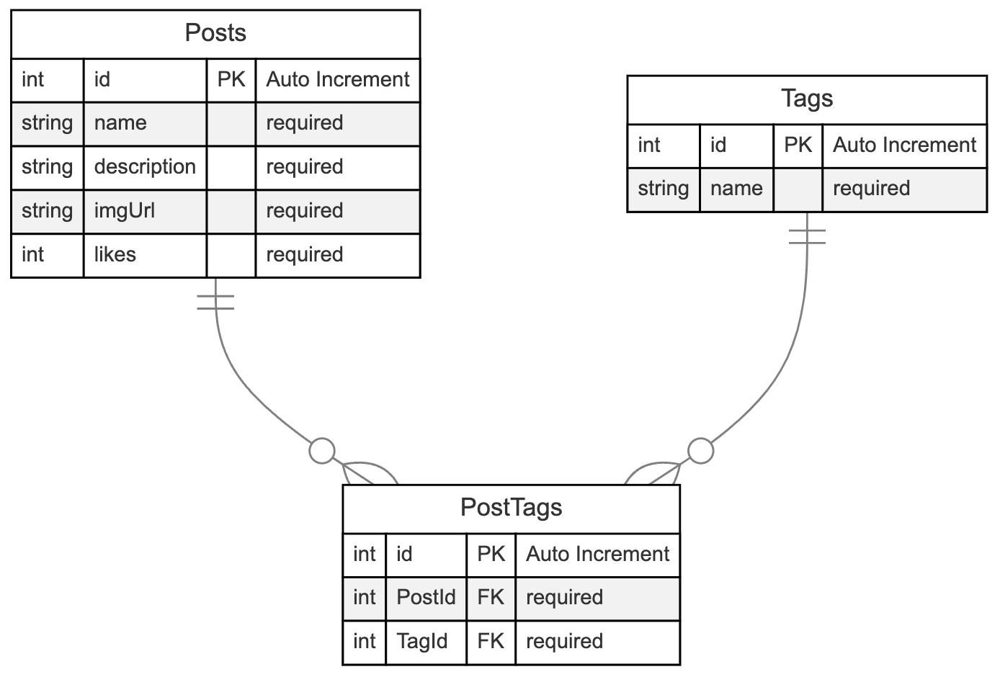
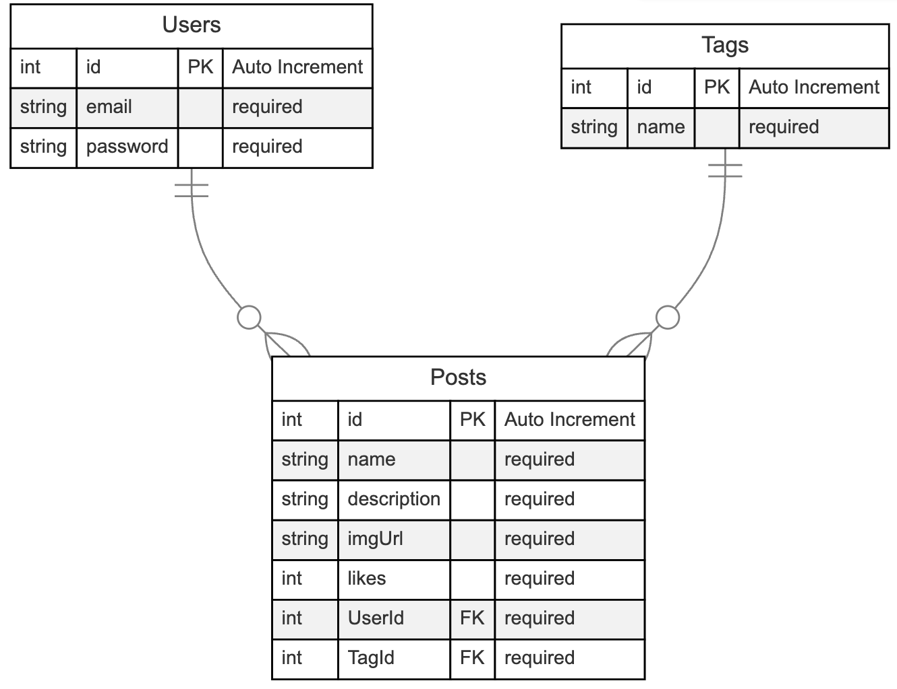

# M:M Association

Jadi, dengan menggunakan sequelize, kita perlu mendeclare asosiasi di model agar bisa melakukan **Eager Loading**
 
 
[Dokumentasi Asosiasi sequelize](https://sequelize.org/docs/v6/core-concepts/assocs/)
 
Di sequelize terbagi menjadi 4 tipe asosiasi yang kita bisa gunakan yaitu :
- HasOne 
- BelongsTo 
- HasMany
- BelongsToMany

## BelongsToMany VS HasMany
Kita bisa menggunakan **HasMany** & **BelongsToMany** untuk hubungan M:M, lalu kapan kita pakai **HasMany** atau **BelongsToMany** ? Apa perbedaannya? 
 
 
Kita akan menggunakan **BelongsToMany** ketika hubungan antar table tersebut **M:M** dan hubungan table yang memiliki table conjunction yang tidak akan kita baca sebagai entitas. Contoh ERD seperti dibawah ini :
 

 
Tapi bagaimana jika table conjunctionnya dibaca sebagai entitas seperti contoh hubungan table dibawah?
 

 
 
Jika table conjunction dibaca sebagai entitas seprti table **Post**, maka asosiasi yang kita gunakan lebih baik menggunakan **HasMany**. Kenapa? karena jika kita menggunakan asosiasi **BelongsToMany** , kita tidak akan bisa membaca data dari table **Post**  

## Conclusion
### HasMany
**Pros** 
- Bisa membaca data duplikat
- Bisa membaca data table conjunction (yg memiliki FK lebih dari 1)
 

**Cons**
- Pada saat eager loading harus nested
- Secara query lebih lama sedikit

### BelongsToMany
**Pros**
- Secara query lebih cepat
- Pembuatan asosiasi lebih mudah
- Pada saat eager loading bisa langsung , tidak nested
 

**Cons**
- Tidak bisa membaca data duplikat
- Secara default tidak bisa membaca data id dari table conjunction (yg memiliki FK lebih dari 1)
